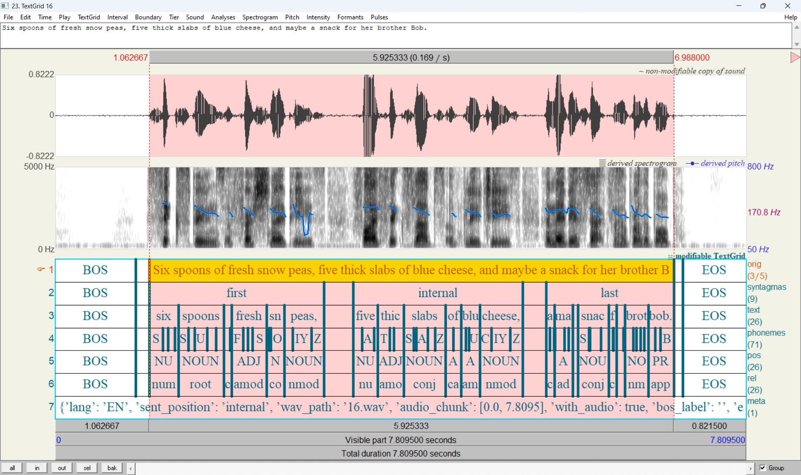

# SpeechFlow

A speech processing toolkit designed for easy configuration of complex speech data preparation pipelines and rapid prototyping of text-to-speech (TTS) models.

## Overview

This project provides a comprehensive solution for TTS development, featuring:
- [Multilingual text processing frontend](https://github.com/just-ai/multilingual-text-parser)
- Forced alignment models
- Modular framework for building TTS systems from reusable components

Check out these [examples](/examples) to learn more about the framework design.

## News

- **April 2025:**
  - 🔥 SpeechFlow 1.0 is now available!

## Installation

### Prerequisites
1. Install [Anaconda](https://www.anaconda.com/)
2. Clone a repository and update submodules

```
git clone https://github.com/just-ai/speechflow
cd speechflow
git submodule update --init --recursive -f
```

### On Ubuntu:

3. Install system dependencies:

```bash
sudo apt-get update
sudo apt-get install -y libssl1.1 g++ wget sox ffmpeg
```

4. Configure Python environment:

```bash
conda create -n py310 python=3.10
conda activate py310
pip install -r requirements.txt
pip install fairseq==0.12.2 --no-deps
```

5. Install [multilingual frontend](https://github.com/just-ai/multilingual-text-parser) dependencies:

```bash
# Install .NET SDK
wget https://packages.microsoft.com/config/ubuntu/20.04/packages-microsoft-prod.deb -O packages-microsoft-prod.deb
sudo dpkg -i packages-microsoft-prod.deb
rm packages-microsoft-prod.deb

sudo apt-get install -y apt-transport-https && apt-get update
sudo apt-get install -y dotnet-sdk-5.0 aspnetcore-runtime-5.0 dotnet-runtime-5.0 nuget

# install eSpeak
sudo apt-get install -y espeak-ng
```

6. Complete installation:

```bash
sh libs/install.sh
pytest tests  # run verification tests
```

### On Windows:

1. Install [Python 3.10](https://repo.anaconda.com/miniconda/Miniconda3-py310_24.5.0-0-Windows-x86_64.exe)

2. Install additional components:
   - [.NET 5.0 Runtime](https://dotnet.microsoft.com/en-us/download/dotnet/5.0),
   - [Microsoft Visual C++ Build Tools](https://visualstudio.microsoft.com/ru/visual-cpp-build-tools/) or [Microsoft Visual Studio](https://visualstudio.microsoft.com/ru/downloads/),
   - [eSpeak](https://github.com/espeak-ng/espeak-ng),
   - [FFmpeg](https://github.com/icedterminal/ffmpeg-installer)

3. Install Python packages:

```bash
pip install -r requirements.txt
pip install fairseq==0.12.2 --no-deps
pip install -Ue libs/multilingual_text_parser
```

### [Singularity Installation](https://docs.sylabs.io/guides/3.11/admin-guide/installation.html)

For containerized deployment:

```bash
sh env/singularity.sh  # Install Singularity
sh install.sh
singularity shell --nv --writable --no-home -B .:/src --pwd /src torch_*.img
source /ext3/miniconda3/etc/profile.d/conda.sh && conda activate py310
```

## Data Annotation

Generate [Praat/TextGrid annotation files](https://www.fon.hum.uva.nl/praat/manual/TextGrid_file_formats.html) for training datasets.

Our annotation pipeline automates:
 - Audio segmentation into utterances
 - Text normalization and phonetic transcription
 - Forced alignment
 - Audio postprocessing (sample rate conversion, volume normalization)

### Supported Languages

RU, EN, IT, ES, FR-FR, DE, PT, PT-BR, KK (additional languages via [eSpeak-NG](https://github.com/espeak-ng/espeak-ng))

### Annotation Process

**1) Prepare dataset structure**

        dataset_root:
        - languages.yml
        - language_code_1
          - speakers.yml
          - single-speaker-dataset
            - file_1.wav
            - file_1.txt
              ...
            - file_n.wav
            - file_n.txt
          - multi-speaker-dataset
            - speaker_1
              - file_1.wav
              - file_1.txt
              ...
              - file_n.wav
              - file_n.txt
              ...
            - speaker_n
              - file_1.wav
              - file_1.txt
              ...
              - file_n.wav
              - file_n.txt
        - language_code_n
          - speakers.yml
          - dataset_1
          ...
          - dataset_n

We recommend using normalized transcriptions that exclude numbers and abbreviations.
For supported languages, [this package](https://github.com/just-ai/multilingual-text-parser) will automatically handle text normalization.

Transcription files are optional. If only audio files are provided, transcriptions will be generated automatically using the [Whisper Large v2](https://huggingface.co/openai/whisper-large-v2) ASR model.

For optimal processing, split large audio files into 20–30 minute segments.

The tool supports annotation of datasets with single or multiple speakers.
To better understand the structure of source data directories and the formats of the [languages.yml](examples/simple_datasets/speech/SRC/languages.yml) and [speakers.yml](examples/simple_datasets/speech/SRC/EN/speakers.yml) configuration files, refer to the provided [example](examples/simple_datasets/speech/SRC).

**2) Run annotation processing**

The annotation process includes segmenting the audio file into single utterances, normalizing the text, generating a phonetic transcription, performing forced alignment of the transcription with the audio chunk, detecting silence, converting the audio sample rate, and equalizing the volume.

We provide pre-trained [multilingual forced alignment models](https://huggingface.co/IlyaKalinovskiy/multilingual-forced-alignment/tree/main/mfa_v1.0) at the phoneme level.
These models were trained on 1,500 hours of audio (from over 8,000 speakers across 9 languages), including datasets such as [LJSpeech](https://keithito.com/LJ-Speech-Dataset/), [VCTK](https://datashare.ed.ac.uk/handle/10283/2651), [LibriTTS](https://arxiv.org/abs/1904.02882), [Hi-Fi TTS](https://arxiv.org/abs/2104.01497), and others.

Run this script to get segmentations:

*setup for single GPU, the minimum requirement is 64GB of RAM and 24GB of VRAM*
```
python -m annotator.runner
   -d source_dataset_path
   -o segmentation_dataset_name_or_path
   -ngpu 1 -nproc 16
   --pretrained_models mfa_stage1_epoch=29-step=468750.pt mfa_stage2_epoch=59-step=937500.pt
   [--batch_size <int>]  # adjust batch size to match your device’s capabilities (bs=16 by default)
```

*setup for multi GPU, the minimum requirement is 256GB of RAM and 24GB of VRAM per GPU*
```
python -m annotator.runner
   -d source_dataset_path
   -o segmentation_dataset_name_or_path
   -ngpu 4 -nproc 32 -ngw 8
   --pretrained_models mfa_stage1_epoch=29-step=468750.pt mfa_stage2_epoch=59-step=937500.pt
   [--batch_size <int>]
```

To improve the alignment of your data, use the flag `--finetune_model` (or without a checkpoint for training from scratch):
```
python -m annotator.runner
   -d source_dataset_path
   -o segmentation_dataset_name_or_path
   -ngpu 1 -nproc 16
   [--finetune_model mfa_stage1_epoch=29-step=468750.pt]
   [--batch_size <int>]
```

To process individual audio files, use [this interface](annotator/eval_interface.py#L247).

The `*.TextGrid` files can be opened in [Praat](https://www.fon.hum.uva.nl/praat/). Additional examples are available [here](examples/simple_datasets/speech/SEGS).


Our alignment model are based on the [Glow-TTS](https://github.com/jaywalnut310/glow-tts) codebase.
Unlike [CTC-based alignment methods](https://pytorch.org/audio/main/tutorials/ctc_forced_alignment_api_tutorial.html), the MAS-based approach (Monotonic Alignment Search) provides fine-grained token positioning.
Additionally, we implemented a two-stage training scheme to detect silences of varying durations between words in speech signal and to insert SIL tokens into corresponding positions in the text transcription.

We also address the long-standing issue of instability during training speech synthesis models, which occurs when voiced phrases contain prolonged silence at the beginning or end.
This issue is resolved by annotating such silent segments with BOS/EOS tokens and subsequently removing them during audio files loading in the data preparation pipeline.

## Text-to-Speech Development

> [!NOTE]
> The default batch size for the training configs is set for a single A100 80GB GPU.

> [!TIP]
> If you find any issues, add an environment variable `VERBOSE=1` to enable extended logging.

### Training acoustic models

1. Build a dump with precompute features for TTS task.

Calculating certain features (e.g., biometric embeddings or SSL features) can be computationally expensive.
To optimize batch processing, we precompute these features using a GPU for each data sample and store them on disk.
For details about which handlers are cached, refer to the [dump section](tts/acoustic_models/configs/tts/tts_data_24khz.yml#L160).

```
python -m tts.acoustic_models.scripts.dump
   -cd tts/acoustic_models/configs/tts/tts_data_24khz.yml
   -nproc 5 -ngpu 1  # [-nproc 20 -ngpu 4] for multi-GPU configuration
   [--data_root segmentation_dataset_path]  # replaces the default dataset path in the config
   [--value_select ru]  # for the Russian language
```

2. Training a Conditional Flow Matching (CFM) model

After the dump is created run the script for model training.

```
python -m tts.acoustic_models.scripts.train
   -cd tts/acoustic_models/configs/tts/tts_data_24khz.yml
   -c tts/acoustic_models/configs/tts/cfm_bigvgan.yml
   [--data_root segmentation_dataset_path] [--value_select ru]
   [--batch_size <int>]  # adjust the batch size to match your device’s capabilities
```

### Training vocoders

You can use [BigVGAN](https://huggingface.co/nvidia/bigvgan_v2_24khz_100band_256x) for convert the output mel-spectrogram of acoustic model into an audio signal.
However, we recommend fine-tuning this vocoder for your voices.

```
python -m tts.vocoders.scripts.train
   -cd tts/vocoders/configs/vocos/mel_bigvgan_data_24khz.yml
   -c tts/vocoders/configs/vocos/mel_bigvgan.yml
   [--data_root segmentation_dataset_path] [--batch_size <int>]
```

### Training End-to-End TTS

You can also perform joint training of the acoustic model and the vocoder using a GAN-like scheme.

```
python -m tts.vocoders.scripts.train
   -cd tts/vocoders/configs/vocos/e2e_tts_data_24khz.yml
   -c tts/vocoders/configs/vocos/styletts2_bigvgan.yml
   [--data_root segmentation_dataset_path] [--value_select ru] [--batch_size <int>]
```

> [!IMPORTANT]
> First, create a feature dump for the e2e_tts_data_24khz.yml configuration file

### Training expressive and controllable TTS

You can build a prosodic model to enhance the expressiveness of synthetic voices.
For further details on this method, please refer to our [paper](https://www.isca-archive.org/interspeech_2024/korotkova24_interspeech.html#).

1. Build a dump of the required features

```
python -m tts.acoustic_models.scripts.dump
   -cd tts/acoustic_models/configs/prosody/prosody_data_24khz.yml
   -nproc 5 -ngpu 1  # [-nproc 20 -ngpu 4] for multi-GPU configuration
   [--data_root segmentation_dataset_path] [--value_select ru]
```

2. Training prosody model

```
python -m tts.acoustic_models.scripts.train
   -cd tts/acoustic_models/configs/prosody/prosody_data_24khz.yml
   -c tts/acoustic_models/configs/prosody/prosody_model.yml
   [--data_root segmentation_dataset_path] [--value_select ru] [--batch_size <int>]
```

3. Update datasets

Here, we add a prosody tier to the `*.TextGridStage3` segmentation files, which will contain indices of prosodic contours at the word level.

```
python -m tts.acoustic_models.scripts.prosody_annotation
   -ckpt /path/to/prosody_model_checkpoint
   -nproc 5 -ngpu 1
   [--data_root segmentation_dataset_path] [--batch_size <int>]
```

4. Training prosody prediction model using text

```
python -m nlp.prosody_prediction.scripts.train
   -cd nlp/prosody_prediction/configs/data.yml
   -c nlp/prosody_prediction/configs/model.yml
   [--data_root segmentation_dataset_path] [--value_select ru] [--batch_size <int>]
```

5. Training TTS models

   Similar to the steps discussed above.

### Inference example

See [eval.py](tts/acoustic_models/scripts/eval.py)

## BibTeX
```
@inproceedings{korotkova24_interspeech,
  title     = {Word-level Text Markup for Prosody Control in Speech Synthesis},
  author    = {Yuliya Korotkova and Ilya Kalinovskiy and Tatiana Vakhrusheva},
  year      = {2024},
  booktitle = {Interspeech 2024},
  pages     = {2280--2284},
  doi       = {10.21437/Interspeech.2024-715},
  issn      = {2958-1796},
}
```

## References

Our TTS models heavily rely on insights and code from various projects.

[Glow-TTS](https://github.com/jaywalnut310/glow-tts)
 | [FastSpeech](https://github.com/xcmyz/FastSpeech)
 | [ForwardTacotron](https://github.com/spring-media/ForwardTacotron?ysclid=m9jrjv0eap586325743)
 | [Tacotron2](https://github.com/NVIDIA/tacotron2?ysclid=m9jqzxwcci105369664)
 | [StyleTTS2](https://github.com/yl4579/StyleTTS2)
 | [StableTTS](https://github.com/KdaiP/StableTTS)
 | [XTTS](https://github.com/coqui-ai/TTS)
 | [Vocos](https://github.com/gemelo-ai/vocos)
 | [HiFi-GAN](https://github.com/jik876/hifi-gan)
 | [BigVGAN](https://github.com/NVIDIA/BigVGAN)
